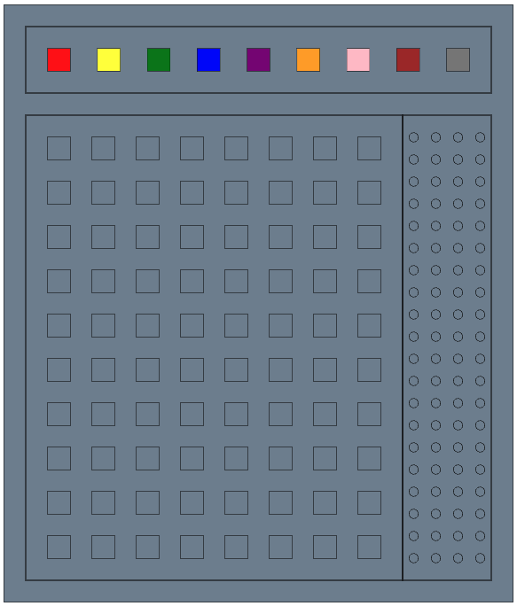
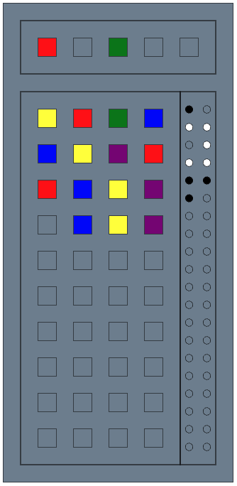

# Кодер: Шпионский Взлом
Увлекательная игра, где вы в роли Хакера пытаетесь разгадать тайный код, созданный Кодировщиком из разноцветных фишек. Используйте свою логику и стратегию, чтобы угадать комбинацию.

## Цель игры:
Вам нужно отгадать комбинацию, сформированную из цветных фишек.

## Игровое поле:
Игровое поле разделено на несколько частей: верхняя часть содержит фишки для вашего использования.
Ниже расположены ячейки для их размещения. В правой части экрана расположены проверочные позиции, которые отображают результаты каждой попытки.

## Механика игры:
### Ход:
- Переместите с помощью мыши цветные фишки в ячейки текущего хода для составления предполагаемой комбинации.
- Если хотите изменить расположение фишек, вы можете вернуть их на исходное место, кликнув по ним дважды.
- Если вы установите новую фишку в уже занятую ячейку, предыдущая фишка вернется на свое исходное место. Это позволяет вам менять комбинации и экспериментировать с различными вариантами составления кода.

### Оценка хода:
- После каждой попытки Кодировщик оценивает ваш ход:
  - Белая фишка: угадан цвет, но не местоположение.
  - Черная фишка: угаданы и цвет, и его расположение.

### Победа:
У вас есть ограниченное количество попыток, чтобы взломать код и победить в этой шпионской дуэли.

Игра требует сочетания интуиции, аналитических способностей и стратегического мышления. Удачи в виртуальном шпионаже!
