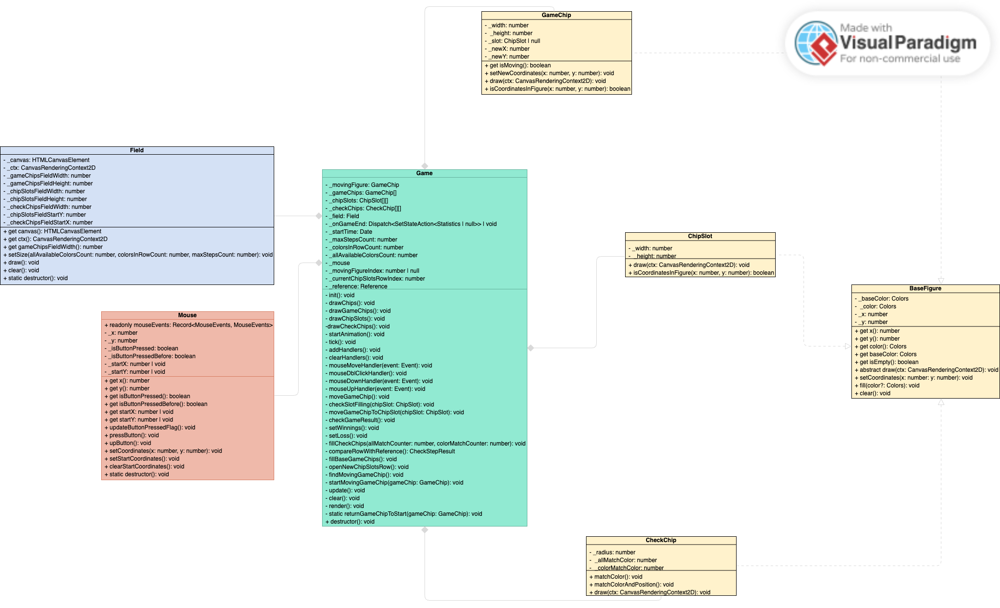

# Игровой движок

## UML диаграмма общих взаимосвязей

## Классы

### BaseFigure

Абстрактный класс BaseFigure, который служит основой для различных фигур на поле.

Этот класс BaseFigure имеет 4 приватных поля:

- \_baseColor;
- \_x;
- \_y;
- \_color.

Класс имеет геттеры и методы для основных преобразований фигур:

- установки координат;
- заполнения цветом;
- очистки;
- проверки на пустоту.

Базовый класс имеет абстрактный метод draw, что означает, что любой класс, наследующий BaseFigure, должен предоставить собственную реализацию этого метода.

### GameChip

Класс наследуется от BaseFigure и представляет игровую фишку.

GameChip расширяет BaseFigure, добавляя свои уникальные поля, такие как:

- \_width;
- \_height;
- \_slot;
- \_newX;
- \_newY.

Он также имеет геттеры и реализует методы для:

- проверки, находится ли фишка в движении;
- установки новых координат;
- отрисовки фишки;
- проверки, находятся ли заданные координаты внутри фишки.

### ChipSlot

Класс наследуется от BaseFigure и представляет игровую ячейку.

ChipSlot расширяет BaseFigure и добавляет свои уникальные поля

- \_width;
- \_height.

Класс реализует методы для:

- отрисовки ячейки;
- проверки, находятся ли заданные координаты внутри ячейки.

### CheckChip

CheckChip наследует BaseFigure и представляет собой проверочную фишку.

Он содержит уникальные поля

- \_radius;
- \_allMatchColor;
- \_colorMatchColor.

Класс реализует методы для:

- пометки фишки в зависимости от соответствия цвета и/или положения игровой фишки;
- отрисовки фишки.

### Field

Класс Field представляет игровое поле и содержит информацию о размерах различных областей поля, таких как область игровых фишек, ячеек и фишек проверки.

Этот класс также отвечает за отрисовку игрового поля на холсте.

Field содержит приватные поля, такие как:

- элемент canvas;
- контекст ctx;
- размеры различных областей поля.

Конструктор класса используется для инициализации полей, и методы draw, clearGameField и destructor отвечают за отрисовку, очистку поля и деинициализацию объекта поля соответственно.

### Mouse

Класс Mouse управляет состоянием мыши на холсте и содержит информацию о её положении, состоянии кнопок и других событиях мыши.

Mouse содержит приватные поля для отслеживания положения мыши, состояния нажатия кнопки и других свойств.
Он предоставляет методы для:

- получения информации о положении мыши;
- обновления флагов нажатия кнопки;
- установки и очистки координат мыши;
- деинициализации объекта Mouse.

### Game

Класс Game управляет игровой логикой, контролирует все основные элементы игры, включая фишки, ячейки, рендеринг, обработку действий пользователя с помощью мыши и определение результатов игры.

Game содержит приватные поля для управления фишками, ячейками, временем начала игры, мышью и другими свойствами игры. Он также реализует методы для инициализации игры, рисования элементов игрового поля, обработки действий мыши, обновления и рендеринга игровых элементов, а также проверки результата игры и завершения игры.
